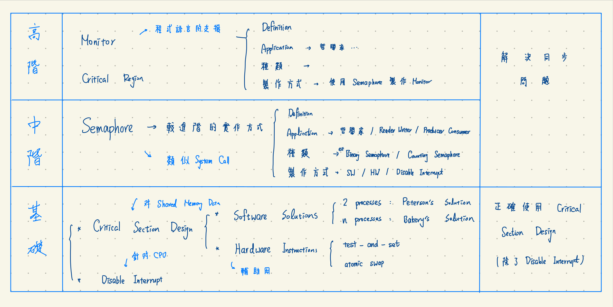

+++
date = '2024-12-08T14:42:36+08:00'
title = 'Operating_System_CH6'
+++

# 作業系統 CH6

- CH6 : Process Synchronization
    - process Communication 運作的兩種方式
    - Race Condition Problem
    - Race Condition 的求解的兩大策略
        - Disable interrupt
        - Critical section Design
    - C.S. Design 基本認知
    - 正確的 C.S. Design 該滿足的3個 Criteria
        1. mutual exclusion
        2. progress
        3. bounded waiting
    - C.S. Design 方法
        - SW solution
            - 2 processes : peterson's solution/ (Dekker's solution)
            - n processes : Bakery's algorithm
        - HW 指令支援
            - test-and-set 
            - swap
            - semaphore
        - semaphore
        - monitor
    - 著名的同步問題的解決方法
        - Producer - consumer problem
        - Reader / Writer Problem
        - The sleeping Barber
        - The Dinner philosophers
    - Message Passing 技術
        - Direct vs. Indirect、send、receive 指令配合 Blocking 

## Process Communication 運作的兩種方式

1. Shared Memory 
2. Message Passing

| **項目**       | **Shared Memory**                      | **Message Passing**          |
|----------------|----------------------------------------------|-------------------------------------|
| **定義**      | 透過共享變數溝通。                           | 建立連結後傳輸 Message。            |
| **特色**      | Programmer 負責，OS 提供共享區域。            | 適合連結管理與例外處理。            |
| **優點**      | 快速，適合大量資訊，OS 無需額外支援。         | 簡單易用，僅需 send/receive 指令。  |
| **缺點**      | 需互斥控制，防止競態條件。                   | 需 kernel 介入，速度較慢。          |

### Share Memory (共享記憶體)

**定義：** 透過對共享變數的存取，讓 Process 之間進行溝通。

**特色：** 由 **Programmer 負責實作**，OS 只需提供共享記憶體區域。

**優點：**  
- OS 無需額外支援，僅需提供共享記憶體功能即可。  
- 適合 **大量資訊傳輸**，溝通速度快，因為不需要 Kernel 介入。

**缺點：** 需要對共享變數進行 **互斥控制**，避免 Race Condition 的發生。

### Message Passing (訊息傳遞)

**定義：** Process 通過以下步驟進行通訊：  
1. 建立 **Communication Link**（通訊連結）  
2. 傳輸訊息  
3. 釋放連結  

**特色：** 適用於 **Communication Link 管理** 及某些例外處理。

**優點：** **程式編寫簡單，** Programmer 無需撰寫額外控制程式，僅需使用 `send` 和 `receive` 指令。

**缺點：**  
- 需 **Kernel 介入**，溝通速度較慢。  
- 適用於 **少量訊息** 的傳輸。

## 6-2 Race Condition

定義 : 
在 Shared Memory Communication 的環境中，若未對共享變數 (Shared Variable) 提供互斥存取(mutaul exclusive accrss)的控制，共享變數最終結果會因為 Process 之間的交錯執行順序不同而有所不同，這種的 Data inconsistency 稱為 Race Condition。

- image reference : [site](https://medium.com/%E7%A8%8B%E5%BC%8F%E4%BA%BA%E6%9C%88%E5%88%8A/%E7%AB%B6%E7%88%AD%E6%83%85%E6%B3%81%E7%9A%84c%E8%AA%9E%E8%A8%80%E7%AF%84%E4%BE%8B-1a88df31c20e)
- Example Code: [Race Condition 實驗記錄](https://hackmd.io/@91UWhfTFSYS7v0K-bURk6A/HyJwG2zV1g)

## Race Condition 的求解的兩大策略
- Disable interrupt
- Critical section Design

(略)

## C.S. Design 基本認知

## 正確的 C.S. Design 該滿足的3個 Criteria
### Mutual Exclusion
### Progress
### Bounded Waiting

## C.S. Design 方法

### SW Solution
#### 2 Processes: Peterson's Solution / Dekker's Solution
#### n Processes: Bakery's Algorithm
### HW 指令支援
#### Test-and-Set
#### Swap
#### Semaphore
### Semaphore
### Monitor

## 著名的同步問題的解決方法
### Producer-Consumer Problem
### Reader/Writer Problem
### The Sleeping Barber
### The Dining Philosophers

## Message Passing 技術
### Direct vs. Indirect
### Send / Receive 指令配合 Blocking

## reference 
1. [大碩 資工研究所 筆記](https://www.ptt.cc/bbs/graduate/M.1552651462.A.B84.html)
2. [Day-26 Process Synchronization](https://ithelp.ithome.com.tw/articles/10278735)
3. [競爭情況的C語言範例](https://medium.com/%E7%A8%8B%E5%BC%8F%E4%BA%BA%E6%9C%88%E5%88%8A/%E7%AB%B6%E7%88%AD%E6%83%85%E6%B3%81%E7%9A%84c%E8%AA%9E%E8%A8%80%E7%AF%84%E4%BE%8B-1a88df31c20e)
4. [作業系統Ch6: Process Synchronization](https://hackmd.io/@WenHsuanYu/OS-Ch6)
5. [Operating System Concepts](https://os.ecci.ucr.ac.cr/slides/Abraham-Silberschatz-Operating-System-Concepts-10th-2018.pdf)