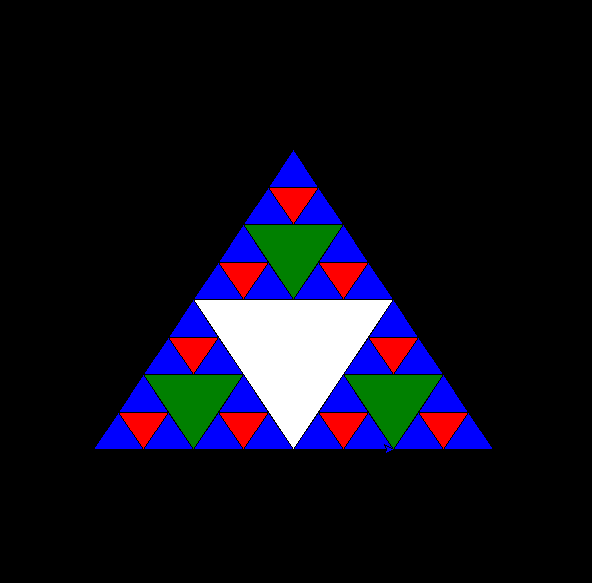

+++  
date = '2024-11-06T12:39:48+08:00'  
title = 'Sierpinski_Gasket'  
image = "pawel-czerwinski-yUkcmOU07CQ-unsplash.jpg"  
categories = [
    "Graphic Programming"
]
+++

# Exploring the Sierpinski Gasket

In the vast field of mathematics, fractal geometry has attracted countless people's attention with its unique self-similarity and infinite complexity. Among them, the **Sierpinski Gasket** (also known as the Sierpinski Triangle) stands as a classic representative of fractal geometry, showcasing the infinite beauty hidden within simple rules. Today, we will dive deep into the Sierpinski Gasket, exploring its construction methods, mathematical properties, and real-world applications.



## What is the Sierpinski Gasket?

The Sierpinski Gasket, also known as the Sierpinski Triangle, is a fractal structure proposed by Polish mathematician Wacław Sierpiński in 1915.

## Methods for Constructing the Sierpinski Gasket

There are several methods to construct the Sierpinski Gasket, with the most intuitive being the iterative approach. Below are two common construction methods:

### 1. Removing the Central Triangle

1. **Initial Shape**: Start with an equilateral triangle.
2. **First Iteration**: Divide the initial triangle into four smaller equilateral triangles and remove the central one.
3. **Subsequent Iterations**: Repeat the above step for each remaining smaller triangle, progressively removing the middle part of each triangle.

As the number of iterations increases, the remaining shape gets closer and closer to the Sierpinski Gasket, revealing its unique honeycomb-like structure.

### 2. Recursive Definition

The Sierpinski Gasket can also be defined using recursive functions, where each level's shape is a self-similar scaled-down version of the previous level. This method is particularly useful in computer graphics to efficiently generate complex fractal patterns.

## Mathematical Properties of the Sierpinski Gasket

The Sierpinski Gasket is not only visually striking but also possesses fascinating mathematical properties:

- **Self-Similarity**: No matter the scale at which it is observed, the Sierpinski Gasket shows a similar structure.
- **Fractal Dimension**: The fractal dimension of the Sierpinski Gasket is approximately 1.585, which is larger than a one-dimensional line segment but smaller than a two-dimensional plane, reflecting its complex geometric structure.
- **Infinite Detail**: As the number of iterations increases, the details of the shape become infinitely rich and cannot be fully described by finite geometric figures.

## Applications of the Sierpinski Gasket

Although the Sierpinski Gasket originated from pure mathematical research, its unique structure has found applications in several fields:

- **Computer Graphics**: It is used to generate complex patterns and textures, enhancing the detail and realism of graphics.
- **Art and Design**: Its distinct visual effect is often applied in decorative art, architectural design, and other fields to create captivating visual works.
- **Similar Structures in Nature**: Fractal-like structures can be found in nature, such as the vein structure of some plants and the shape of snowflakes, demonstrating the universality of fractal geometry in the natural world.

## How to Draw the Sierpinski Gasket

Drawing the Sierpinski Gasket not only helps us better understand its construction principles but also exercises programming and mathematical thinking. Below is an example code for drawing the Sierpinski Gasket using Python's Turtle module:

```python
import turtle

def draw_triangle(vertices, color, my_turtle):
    my_turtle.fillcolor(color)
    my_turtle.up()
    my_turtle.goto(vertices[0][0], vertices[0][1])
    my_turtle.down()
    my_turtle.begin_fill()
    my_turtle.goto(vertices[1][0], vertices[1][1])
    my_turtle.goto(vertices[2][0], vertices[2][1])
    my_turtle.goto(vertices[0][0], vertices[0][1])
    my_turtle.end_fill()

def sierpinski(vertices, level, my_turtle):
    colors = ['blue','red','green','white','yellow',
              'violet','orange']
    draw_triangle(vertices, colors[level], my_turtle)
    if level > 0:
        sierpinski([vertices[0],
                    get_mid(vertices[0], vertices[1]),
                    get_mid(vertices[0], vertices[2])],
                   level-1, my_turtle)
        sierpinski([vertices[1],
                    get_mid(vertices[0], vertices[1]),
                    get_mid(vertices[1], vertices[2])],
                   level-1, my_turtle)
        sierpinski([vertices[2],
                    get_mid(vertices[2], vertices[1]),
                    get_mid(vertices[0], vertices[2])],
                   level-1, my_turtle)

def get_mid(point1, point2):
    return ((point1[0]+point2[0])/2, (point1[1]+point2[1])/2)

def main():
    my_turtle = turtle.Turtle()
    my_turtle.speed(0)
    turtle.bgcolor('black')
    vertices = [[-200, -100], [0, 200], [200, -100]]
    level = 3  # Adjust the iteration depth
    sierpinski(vertices, level, my_turtle)
    turtle.done()

if __name__ == '__main__':
    main()
```

## Cpp Source Code

Graphic-programming-language CH2 : [here](https://github.com/davidchen0970/Graphic-programming-language/blob/main/CH2/CH2_1%20Sierpinski%20Gasket.md)
