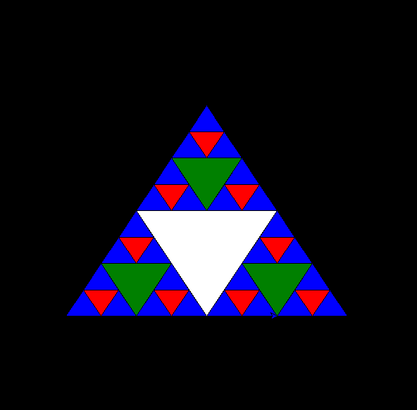

+++
date = '2024-11-06T12:39:48+08:00'
title = 'Sierpinski Gasket'
image = "pawel-czerwinski-yUkcmOU07CQ-unsplash.jpg"
categories = [
    "Graphic Programming"
]
+++

# 探索 Sierpinski Gasket

在數學的廣闊領域中，分形幾何以其獨特的自相似性和無限的複雜性吸引了無數人的目光。其中，**Sierpinski Gasket（謝爾賓斯基三角形）** 作為分形幾何中的經典代表，展現了簡單規則下蘊藏的無限美麗。今天，我們將深入了解 Sierpinski Gasket，探索其構造方法、數學性質及其在現實中的應用。



## 什麼是 Sierpinski Gasket？

Sierpinski Gasket，又稱謝爾賓斯基三角形，是由波蘭數學家瓦茨瓦夫·謝爾賓斯基（Wacław Sierpiński）在 1915 年提出的分形結構。

## Sierpinski Gasket 的建立方法

建立 Sierpinski Gasket 的方法有多種，其中最直觀的是迭代法。以下是常見的兩種構造方式：

### 1. 移除中間三角形法

1. **初始形狀**：從一個等邊三角形開始。
2. **第一次迭代**：將初始三角形分割成四個小的等邊三角形，移除中間的那個。
3. **後續迭代**：對剩下的每一個小三角形重複上述步驟，逐步移除每個小三角形的中間部分。

隨著迭代次數的增加，剩餘的圖形越來越接近 Sierpinski Gasket，展示出其獨特的蜂窩狀結構。

### 2. 遞迴定義法

Sierpinski Gasket 也可以透過遞迴函數來定義，每一層的圖形都是前一層的自相似縮小版本。這種方法在電腦繪圖中特別常用，能夠高效地生成複雜的分形圖案。

## Sierpinski Gasket 的數學性質

Sierpinski Gasket 不僅在視覺上令人嘆為觀止，其數學性質也同樣令人著迷：

- **自相似性**：無論從哪個尺度觀察，Sierpinski Gasket 都呈現出相似的結構。
- **分形維數**：Sierpinski Gasket 的分形維數約為 1.585，比一維線段大，但小於二維平面，反映出其複雜的幾何結構。
- **無窮細節**：隨著迭代次數的增加，圖形的細節變得無限豐富，無法用有限的幾何圖形完全描述。

## Sierpinski Gasket 的應用

儘管 Sierpinski Gasket 起源於純數學研究，但其獨特的結構在多個領域中找到了應用：

- **電腦圖形學**：用於生成複雜的圖案和紋理，提升圖形的細節和真實感。
- **藝術與設計**：其獨特的視覺效果常被應用於裝飾藝術、建築設計等領域，創造出引人入勝的視覺作品。
- **自然界中的類似結構**：類似的分形結構在自然界中也屢見不鮮，如某些植物的葉脈結構、雪花的形態等，展示了分形幾何在自然界中的普遍性。

## 如何繪製 Sierpinski Gasket

繪製 Sierpinski Gasket 的過程不僅能幫助我們更好地理解其構造原理，還能鍛鍊程式設計和數學思維。以下是使用 Python 的 Turtle 模組繪製 Sierpinski Gasket 的範例程式碼：

```python
import turtle

def draw_triangle(vertices, color, my_turtle):
    my_turtle.fillcolor(color)
    my_turtle.up()
    my_turtle.goto(vertices[0][0], vertices[0][1])
    my_turtle.down()
    my_turtle.begin_fill()
    my_turtle.goto(vertices[1][0], vertices[1][1])
    my_turtle.goto(vertices[2][0], vertices[2][1])
    my_turtle.goto(vertices[0][0], vertices[0][1])
    my_turtle.end_fill()

def sierpinski(vertices, level, my_turtle):
    colors = ['blue','red','green','white','yellow',
              'violet','orange']
    draw_triangle(vertices, colors[level], my_turtle)
    if level > 0:
        sierpinski([vertices[0],
                    get_mid(vertices[0], vertices[1]),
                    get_mid(vertices[0], vertices[2])],
                   level-1, my_turtle)
        sierpinski([vertices[1],
                    get_mid(vertices[0], vertices[1]),
                    get_mid(vertices[1], vertices[2])],
                   level-1, my_turtle)
        sierpinski([vertices[2],
                    get_mid(vertices[2], vertices[1]),
                    get_mid(vertices[0], vertices[2])],
                   level-1, my_turtle)

def get_mid(point1, point2):
    return ((point1[0]+point2[0])/2, (point1[1]+point2[1])/2)

def main():
    my_turtle = turtle.Turtle()
    my_turtle.speed(0)
    turtle.bgcolor('black')
    vertices = [[-200, -100], [0, 200], [200, -100]]
    level = 3  # 調整迭代層數
    sierpinski(vertices, level, my_turtle)
    turtle.done()

if __name__ == '__main__':
    main()
```

## Cpp Source Code

Graphic-programming-language CH2 : [here](https://github.com/davidchen0970/Graphic-programming-language/blob/main/CH2/CH2_1%20Sierpinski%20Gasket.md)
