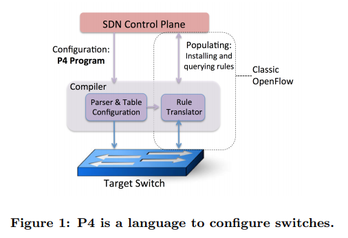
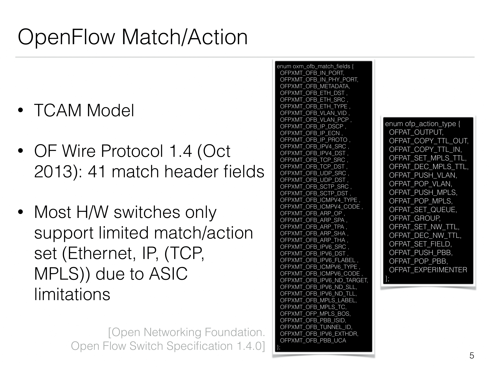
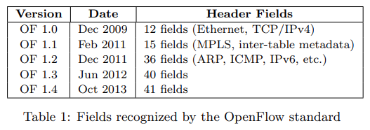

+++
date = '2024-11-07T17:38:34+08:00'
title = 'What is p4'
image = "pawel-czerwinski-ZJk8NX0aR8s-unsplash.jpg"
categories = [
"P4"
]
+++

## P4 網路的介紹與應用

隨著網路技術的快速發展，如何高效靈活地處理流量成為了關鍵議題。 **P4 (Programming Protocol-independent Packet Processors)** 是一種專為軟體定義網路 (SDN) 設計的高階程式語言，用於定義 Data Plane 設備的行為。底下將介紹 P4 的基本概念、核心功能及其應用場景。

## **什麼是 P4？**

P4 是一種高階語言，主要特點是 Data Plane 的可程式性。傳統網路設備 (如路由器和交換機) 的 Data Plane 行為通常由硬體製造商預先定義，缺乏靈活性。而 P4 的出現，允許開發者通過程式自行定義封包處理行為，使網路設備可以更彈性的使用。

P4 具有以下特點：

1. **協定無關性 (Protocol Independence) ：** 可以處理任意協定封包，而不受傳統協定限制。
2. **靈活性高：** 支援使用者定義 Field 和使用其 Field，可以適應不斷變化的需求。
3. **硬體抽象性：** 可運行於多種硬體平台，如 ASIC、FPGA 和網路模擬器。

## OpenFlow 與 P4 的相同和差別

**OpenFlow** 和 **P4** 都是與 SDN 相關的重要技術，提升網路設備的靈活性與可程式性。但它們的設計目的、功能範圍及應用方式有明顯的不同。下面是相關性的說明與差異的比較表格:

### **相關性**

1. **同屬 SDN 範疇：**

   - **OpenFlow** 和 **P4** 都改變了傳統網路設備的固定功能，將更多的控制交給網路管理者，降低硬體製造商對設備的控制。
   - 二者均可以支援動態設定網路，而不是依賴硬體製造商的預設功能。

2. **Data Plane 與 Control Plane 的互動：**

   - OpenFlow 定義了一個 Data Plane 與 Control Plane 之間的通訊標準。
   - P4 則專注在 Data Plane 的可程式化，但可以與 OpenFlow 結合使用，透過 Control Plane 管理 P4 的行為。

3. **軟硬體之間的獨立性：**
   - 二者都把網路的功能從依賴於硬體，轉變成獨立於硬體，使網路的功能可在不同平台上運行。

### **差異性**

| **項目**       | **OpenFlow**                                                                     | **P4**                                                                       |
| -------------- | -------------------------------------------------------------------------------- | ---------------------------------------------------------------------------- |
| **主要目標**   | 標準化 Data Plane 與 Control Plane 之間的通訊協定。                              | 提供 Data Plane 完全的可程式化，定義如何處理封包。                           |
| **控制範圍**   | 針對 Flow Table 的 Match，僅能處理特定協定 (如 IPv4、IPv6、VLAN 等) 。(如圖 1/2) | 可自行定義 Protocol Fields、封包處理邏輯和新協定，具有更高的靈活性。         |
| **層次分工**   | 重點在控制平面， Data Plane 的行為相對固定，由硬體自行設定。                     | 聚焦於 Data Plane ，可自行設計封包解析、處理和轉發行為。                     |
| **適用範圍**   | 適合標準網路設備，用於流量工程、網路優化等控制層面的應用。                       | 更適合需要高度自定義的場景，如研究新協定、特殊安全需求或新型封包格式的處理。 |
| **語言與標準** | 使用固定的 OpenFlow 協定標準，無法靈活定義封包的處理行為。                       | 使用 P4 程式語言，允許完全自定義處理邏輯，支援多種 Data Plane 硬體和平台。   |
| **硬體支援**   | 必須使用支援 OpenFlow 協定的硬體設備。                                           | 支援多種硬體平台，包括 ASIC、FPGA、網路處理器 (NPU) 或者網路模擬器等等。     |
| **協定依賴性** | 固定支援已知協定，無法輕易新增新協定的功能。                                     | 完全協定無關，可自由設計支援任何協定的封包處理。                             |

---

## **P4 的核心結構**

P4 程式的基本組成包括：

- **封包解析器 (Parser) ：** 定義如何解析進入的封包。
- **封包處理邏輯 (Control Block) ：** 指定處理封包的規則，例如轉發、丟棄或修改。
- **封包去解析器 (Deparser) ：** 定義如何重建封包以便發送。

## **P4 的應用場景**

1. **網路監控：**
   P4 可自定義封包處理行為，監控對特定流量。例如，通過執行延遲測量和流量計數來改善網路性能。

2. **流量工程：**
   網路工程師可以設計自定義轉發邏輯，改善流量路徑，實作負載均衡或快速故障恢復。

3. **安全防護：**
   使用 P4 構建動態訪問控制列表 (ACL) 和封包篩選功能，增強網路安全性。

4. **創新協定實驗：**
   研究人員可快速設計並測試新協定，不須等待硬體製造商支援。

## **reference**

1. [P4 - tutorial](https://opennetworking.org/wp-content/uploads/2020/12/P4_D2_East_2018_01_basics.pdf)
2. [P4: Programming Protocol-independent Packet Processors](https://olivermichel.github.io/doc/p4.pdf)
3. [P4 paper (cont.)](https://ithelp.ithome.com.tw/articles/10243915?sc=rss.qu)
